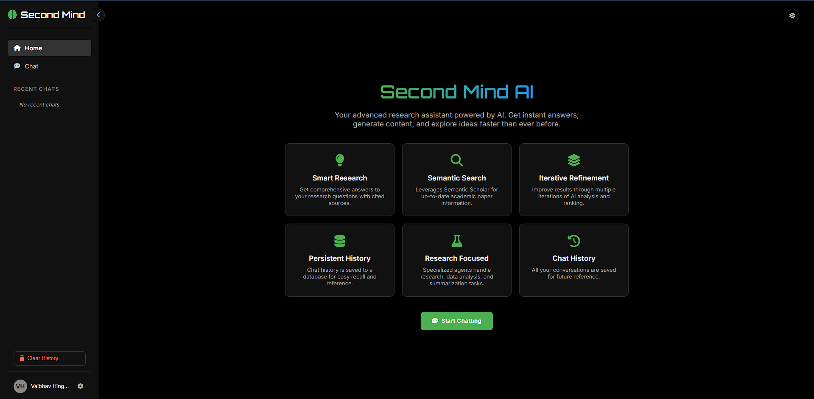
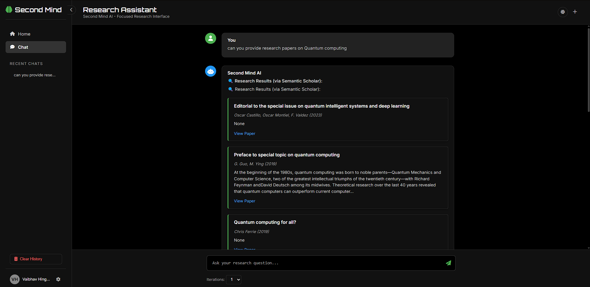

# Second Mind AI

Second Mind AI is an advanced research assistant powered by multiple AI agents. It's designed to help users get comprehensive answers to research questions, find academic papers, summarize content, and iteratively refine information for better quality. The application features a web interface for interaction and stores chat history in a MongoDB database.

## UI Screenshots

Here's a glimpse of the Second Mind AI interface, showcasing its clean design and core functionalities:

**1. Home Page:**

*   **Overview:** The welcoming home page provides a brief introduction to Second Mind AI's capabilities.
*   **Navigation:** A persistent sidebar on the left offers easy navigation to "Home" and "Chat" sections, along with access to "Recent Chats" and a "Clear History" option.
*   **Feature Highlights:** Prominent cards clearly display key features like "Smart Research," "Semantic Search," "Iterative Refinement," "Persistent History," "Research Focused," and "Chat History."
*   **Call to Action:** A "Start Chatting" button encourages users to dive into the research assistant.
*   **User Profile:** The bottom of the sidebar shows a placeholder for the user (Vaibhav Hingnekar) and a settings cog.
*   **Theme:** The screenshot displays the application in its dark theme, offering a modern and focused user experience.

**2. Chat Interface:**

*   **Core Interaction:** This view demonstrates the main chat interface where users interact with the AI.
*   **User Query:** A user's query, "can you provide research papers on Quantum computing," is clearly displayed.
*   **AI Response with Semantic Scholar Integration:** The AI's response showcases its ability to fetch research papers. Multiple results from Semantic Scholar are presented, each including:
    *   Title of the paper (e.g., "Editorial to the special issue on quantum intelligent systems and deep learning").
    *   Author(s) and year (though "None" or missing in some examples shown, this is where they'd appear).
    *   A brief abstract or description.
    *   A "View Paper" link (functionality not visible but implied by the UI element).
*   **Message Bubbles:** Conversations are structured with distinct message bubbles for the user and "Second Mind AI."
*   **Input Area:** A text area at the bottom allows users to "Ask your research question..." with a send button.
*   **Iteration Control:** An "Iterations" dropdown (set to 1 in the screenshot) allows users to control the depth of AI refinement.
*   **Contextual Header:** The chat header clearly labels the current interface as "Research Assistant" and provides additional context. Action buttons like "New Chat" and a theme toggle are also visible in the header.

## Features

*   **Multi-Agent System:** Utilizes specialized sub-agents (Research Assistant, Data Analyzer, Paper Summarizer) for targeted tasks.
*   **Semantic Scholar Integration:** Fetches up-to-date academic paper information directly from the Semantic Scholar API.
*   **Iterative Refinement:** Improves response quality through multiple iterations of AI analysis and ranking.
*   **LLM Integration:** Leverages Large Language Models via the OpenRouter.ai API (Mistral).
*   **Chat History:** Saves conversations to a MongoDB database for persistence and easy recall.
*   **Research Focused:** Primarily designed to handle research-based queries.
*   **Web Interface:** User-friendly frontend built with HTML, CSS, and JavaScript.
*   **Dark/Light Theme:** Switchable themes for user preference.
*   **Responsive Design:** Adapts to different screen sizes.
*   **Health Check Endpoint:** Provides status of backend services (e.g., database connection).

## Tech Stack

*   **Backend:**
    *   Python 3.x
    *   Flask (Web framework)
    *   Flask-CORS (Cross-Origin Resource Sharing)
    *   Pymongo (MongoDB driver)
    *   Requests (HTTP library)
*   **Frontend:**
    *   HTML5
    *   CSS3
    *   JavaScript (Vanilla)
*   **Database:**
    *   MongoDB
*   **AI Service:**
    *   OpenRouter.ai API

## Prerequisites

*   **Python 3.8+**
*   **MongoDB:** Installed and running. The application defaults to `mongodb://localhost:27017/`.
*   **OpenRouter API Key:** You'll need an API key from [OpenRouter.ai](https://openrouter.ai/).

## Setup and Installation

1.  **Clone the Repository:**
    ```bash
    git clone <your-repository-url>
    cd second-mind-ai
    ```

2.  **Create and Activate a Virtual Environment (Recommended):**
    ```bash
    python -m venv venv
    # On Windows
    venv\Scripts\activate
    # On macOS/Linux
    source venv/bin/activate
    ```

3.  **Install Dependencies:**
    ```bash
    pip install -r requirements.txt
    ```

4.  **Configure API Key:**
    Open `main.py` and replace the placeholder for `OPENROUTER_API_KEY` with your actual OpenRouter API key:
    ```python
    # main.py
    # ...
    # --- IMPORTANT: Consider loading keys from environment variables or a config file ---
    OPENROUTER_API_KEY = "YOUR_ACTUAL_OPENROUTER_API_KEY_HERE" # REMOVE BEFORE SHARING/COMMIT
    # ...
    ```
    **Security Note:** For production or shared environments, it's highly recommended to use environment variables or a configuration file to manage sensitive keys instead of hardcoding them.

5.  **Ensure MongoDB is Running:**
    Make sure your MongoDB instance is running and accessible at `mongodb://localhost:27017/`. The application will create the database `second_mind_db` and collection `chat_history` if they don't exist.

## Running the Application

1.  **Start the Flask Backend:**
    Navigate to the project directory (where `main.py` is located) and run:
    ```bash
    python main.py
    ```
    The backend server will typically start on `http://127.0.0.1:5000/`. You'll see log messages in the console, including whether the connection to MongoDB was successful.

2.  **Open the Frontend:**
    Open the `index.html` file in your web browser. You can usually do this by double-clicking the file or right-clicking and selecting "Open with" your preferred browser.

    The frontend will interact with the backend API running on `http://127.0.0.1:5000`.

## Project Structure

second-mind-ai/
├── main.py
├── index.html
├── README.md         <-- New file
└── requirements.txt  <-- New file
└── venv/             <-- (If you created a virtual environment)

## API Endpoints (Backend - `main.py`)

*   **`POST /ask`**:
    *   Accepts a JSON payload: `{ "query": "Your research question", "iterations": 1 }`
    *   Processes the query using the AI orchestrator.
    *   Returns the AI's response and saves the chat to MongoDB.
*   **`GET /history`**:
    *   Retrieves the last 100 chat history items from MongoDB.
*   **`POST /clear_history`**:
    *   Deletes all chat history records from MongoDB.
*   **`GET /health`**:
    *   Checks the status of the application and its dependencies (e.g., database connection).

## Key Code Components (Backend)

*   **`SemanticScholarSearchTool`**: Class responsible for querying the Semantic Scholar API for research papers.
*   **`SubAgent`**: Represents individual AI agents (e.g., Research Assistant). Handles query processing, decides if web search is needed, and interacts with the OpenRouter API.
*   **`MasterAIAgent`**: Orchestrates multiple `SubAgent`s, ranks their responses, and handles iterative refinement of answers.
*   **Flask Routes**: Define the API endpoints (`/ask`, `/history`, `/clear_history`, `/health`) and handle incoming requests.
*   **MongoDB Integration**: Functions for connecting to MongoDB, saving chat interactions, and retrieving history.

## Troubleshooting

*   **MongoDB Connection Failure:**
    *   Ensure MongoDB service is running.
    *   Check if the `MONGO_URI` in `main.py` (`mongodb://localhost:27017/`) is correct for your MongoDB setup.
    *   Firewall rules might be blocking the connection.
    *   The application will log critical errors if it cannot connect to MongoDB at startup. Database-dependent features will fail.
*   **API Errors (OpenRouter/Semantic Scholar):**
    *   Verify your `OPENROUTER_API_KEY` is correct and active.
    *   Check your internet connection.
    *   OpenRouter or Semantic Scholar services might be temporarily unavailable or have rate limits.
    *   Error messages from the API will often be included in the AI's response or logged by the backend.
*   **Frontend Not Connecting to Backend:**
    *   Ensure the Flask backend (`main.py`) is running.
    *   Check the browser's developer console (usually F12) for network errors or CORS issues. Flask-CORS is configured, but ensure the `API_BASE_URL` in `index.html` (`http://127.0.0.1:5000`) matches where the backend is served.

## Future Enhancements (Ideas)

*   Use environment variables for `OPENROUTER_API_KEY` and MongoDB URI.
*   More sophisticated error handling and user feedback.
*   User authentication and per-user chat history.
*   Ability to upload and process documents.
*   Advanced model selection in the UI.
*   Streaming responses for a more interactive feel.
*   Unit and integration tests.

